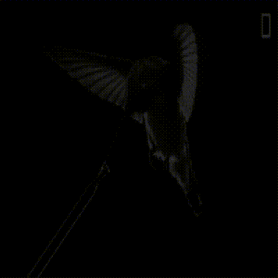
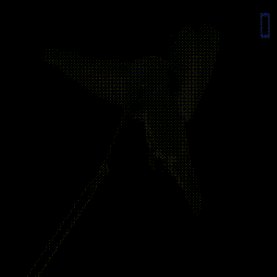
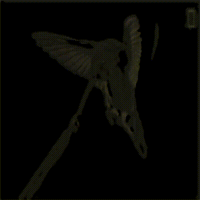
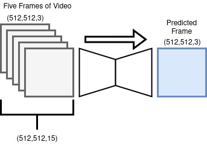
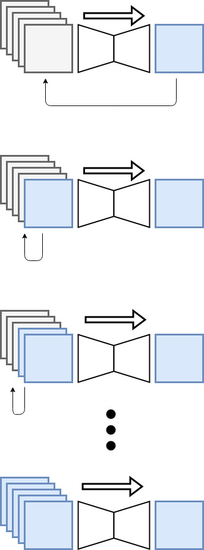
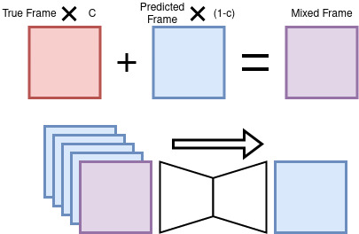

# frame_predictor
AI art tool / video distorter using tensorflow. Taking a video as an input, it distorts it using
deep convolutional neural networks. Model definition is below in the "Model"
section.

## Examples (<a href="https://youtu.be/RtUQ_pz5wlo">original video</a>)
### Model used: bone



### Model used: road



### Model used: darkart



## Requirements
Required packages can be found in requirements.txt, although configuring tensorflow
for your machine is probably going to take <a href="https://www.tensorflow.org/install">some extra work</a>.
```bash
pip3 install -r requirements.txt
```

## Model
The models used are composed of several convolution and pooling layers,
followed be several deconvolutions. The models take a HEIGHT x WIDTH x 15 array
as an input-- this array is created by concatenating 5 RGB images by their color channel.
The model outputs a HEIGHT x WIDTH x 3 array. The inputs are understood to be 5
consecutive frames of a video, and the output is the model's prediction of what the
6th frame would be.



We can feed the predicted frame back into the model to generate new imagined visuals.



### Execution Parameters
There are two different parameters that can be changed to augment the model's
execution. They both essentially help the model "cheat" by giving it information
it "shouldn't" have.

#### c
A poorly named parameter, "c" allows you to provide the model with some information about
the most recent frame in the input array. It takes the true most recent frame and multiplies it
by c, then takes the predicted most recent frame, multiplies it by (1-c), then adds them.



#### history
History allows the model to see *n* many true frames, followed by (5-*n*) many predicted
frames.


### Pretrained weights
There are a handful of pretrained weights included. Here are their names and descriptions.
<ul>
<li>road -> trained on dashcam footage</li>
<li>bone -> trained on a video I made out of exrays</li>
<li>darkart -> trained on <a href=https://youtu.be/M4kVOJfZg_E>this</a> music video
</ul>


## Usage

### CLI (quick-start)

There is a CLI that allows for quick usage. Requires output to end in .mov or .avi
```bash
python3 main.py '/PATH/TO/INPUT/VIDEO.mov' '/PATH/TO/OUTPUT/VIDEO.avi' --preset 1

```
There are three preset configurations available. Additionally, you can mess
with the settings yourself like this

```bash
python3 main.py '/PATH/TO/INPUT/VIDEO.mov' '/PATH/TO/OUTPUT/VIDEO.avi' --c -0.15 --history 4 --model road
```

### Notebook Example
There are three notebook files included. The first is used to prepare data to train a model.
The second is used to train the models. The third is used to execute the model and produce a video. The first two notebooks can be skipped if you're just interested in using the pretrained models. The following is an example of how to execute a custom configuration
in a python script or notebook:

```python3
df = MP4Feeder('/PATH/TO/INPUT/VIDEO.mp4',
                    (512,512,3),
                    "RGB",
                    5,
                    normalization_function = lambda x : np.array([p/255 for p in [r for r in x]]),
                    preprocess_function = None)
```
The above code prepares a DataFeeder which prepares frames for the model.


```python3
t1 = {
    'type':'c',
    'start_frame':0,
    'end_frame':1000,
    'transition_function':lambda x:max((np.sin(x/30)+1)/1.9,-2),
    'p_array':None,

}

t2 = {
    'type':'weights',
    'start_frame':0,
    'end_frame':100,
    'weights_1':'model_weights/model_1',
    'weights_2':'model_weights/model_2',
    'transition_function':None,
    'p_array':None,

}

t3 = {
    'type':'weights',
    'start_frame':100,
    'end_frame':200,
    'weights_1':'model_weights/model_2',
    'weights_2':'model_weights/model_1',
    'transition_function':None,
    'p_array':None,

}

```
The above code prepares 3 transitions, which can be used to change configurations
while the model is running.

```python3
model_fn = make_road_model
weights = 'model_weights/road'
c = 0
history = 1

fp = FrameProducer(model_fn, c, weights, history, df, 5, transitions=[t1], frames_to_produce=60, mode="RGB", vid_output_name='output_video')

fp.go()

```
The above code loads the model and executes it on the input file.
